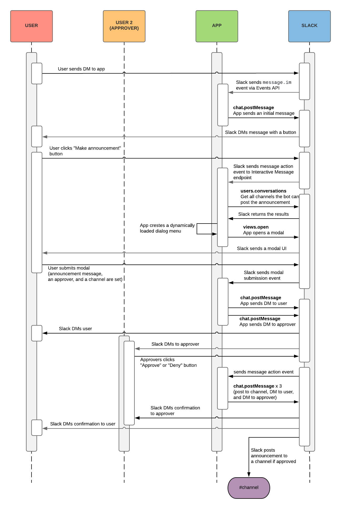

# "OctaBot" Approval Workflows with Modal

---

This app lets its bot to post an approved message into Absensi channel- A user DMs to bot to create a leave, and once it is approved by another users, the message will be posted to Absensi.

## API & Features

This app uses:
- Web API
    - `chat.postMessage` to post messages
    - `conversations.open` to send direct messages from the bot to a user
    - `users.conversations` to get channels the bot user is a member of
    - `views.publish` to publish a view to the Home tab
    - `views.open` to open a Block Kit modal and collect information for the announcement to be sent
    - `conversations.history` to view historical messages between the bot and user
- Events API `message.im` to see when a DM message is sent
- Block Kit messages with interactive buttons
- Block Kit Modals API with dynamic menus

## Setup

### 1. Clone this repo

Clone the repo (then `npm install` to install the dependencies)

#### 2. Create a Slack app

1. Create an app at [api.slack.com/apps](https://api.slack.com/apps)
2. Navigate to the OAuth & Permissions page and add the following Bot token scopes:
    * `channels:read`
    * `chat:write`
    * `im:write`
    * `im:history`
3. Enable the events (See below *Enable the Events API*)
4. Enable the interactive messages (See below *Enable Interactive Messages*)
5. Enable App Home (See below *App Home*)
6. Click 'Save Changes' and install the app (You should get an OAuth access token after the installation

#### Enable the Events API
1. Click on **Events Subscriptions** and enable events.
2. Set the Request URL to your server (or Glitch URL) + `/slack/events` (*e.g.* `https://your-ngrok.com/slack/events`)
3. On the same page, go down to **Subscribe to Bot Events** section and subscribe to these events 
    - `message.im` 
    - `app_home_opened`
4. Save

#### Enable Interactive Messages

To enable interactive UI components (This example uses buttons):

1. Click on **Interactive Components** and enable the interactivity.
2. Set the Request URL to your server (or Glitch URL) + `/slack/interactions`

To dynamically populate a drop-down menu list in a dialog (This example uses a list of channels):

1. Insert the Options Load URL (*e.g.* `https://your-ngrok.com/slack/options`) in the **Message Menus** section
2. Save

#### Enable App Home

To enable App Home:

1. Click on **App Home** and make sure both `Home Tab` and `Messages Tab` are enabled.

#### 3. Run this App
Set Environment Variables and run:

1. Set the following environment variables in `.env` (copy from `.env.sample`):
    * `SLACK_ACCESS_TOKEN`: Your app's `xoxb-` token (available on the Install App page after the installation)
    * `SLACK_SIGNING_SECRET`: Your app's Signing Secret (available on the **Basic Information** page)
2. If you're running the app locally:
    * Start the app (`npm start`)

On Slack client, "invite" your bot to appropriate channels. The bot cannot post messages to the channels where the bot is not added.

## The app sequence diagram

